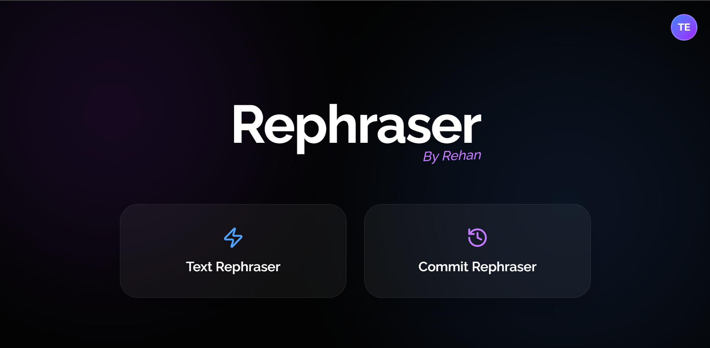
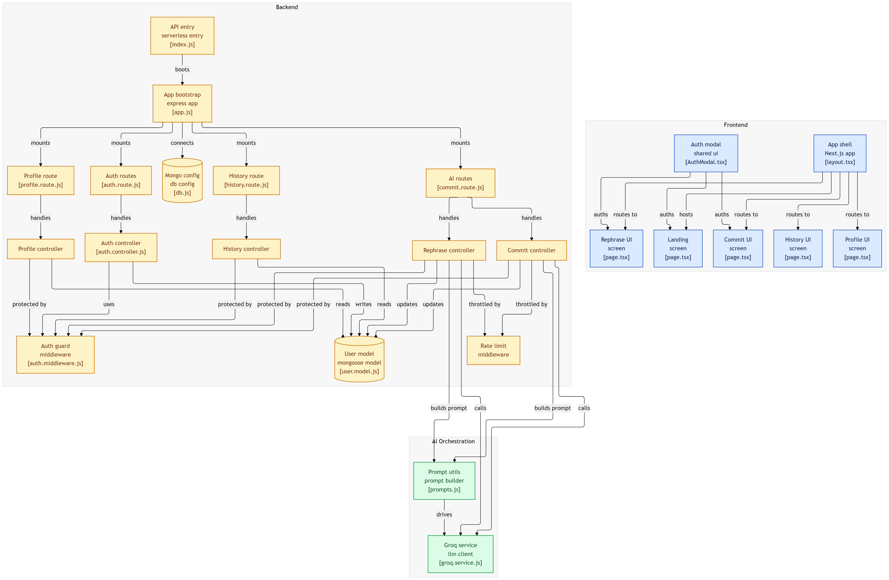

# 🚀 AI Dev Assistant

[](https://ai-dev-assistant-frontend.vercel.app)
[](#)
[](#)
[](#)
[](LICENSE)

> **"Helping developers spend less time writing and more time building."**

AI Dev Assistant is a full-stack AI-powered developer tool that helps developers rewrite text naturally and generate clean **Conventional Commit** messages using customizable tones and intelligent prompts.

---

## 🌐 Live Demo

* **Frontend:** https://ai-dev-assistant-frontend.vercel.app
* **Backend API:** https://ai-dev-assistant-two.vercel.app

---

## 📖 About

AI Dev Assistant was built to simplify common developer workflows by providing focused AI-powered utilities instead of relying on generic chatbot interfaces.

The application currently includes two productivity tools:

* ✍️ **AI Text Rephraser** — Rewrite text in different tones while preserving its meaning.
* 🧠 **Commit Message Generator** — Generate clean Conventional Commit messages from natural language descriptions.

Authenticated users also have access to a personal history dashboard that stores their most recent AI generations for quick reference.

---

## ✨ Features

### ✍️ AI Text Rephraser

* Rewrite text naturally
* Humanize AI-generated content
* Multiple writing tones
* Copy-ready output

### 🧠 Commit Message Generator

* Conventional Commit support
* Smart commit type detection
* Concise, production-ready messages
* Intelligent prompt engineering

### 📜 History

* Stores the latest 10 AI requests
* Saves prompts and responses
* Tracks selected tone and request type

### 🔐 Security

* JWT Authentication
* Protected API routes
* Request rate limiting
* User-specific history

---

## 🖥️ User Interface

The application features a clean and responsive interface designed to minimize distractions while providing quick access to AI-powered developer tools.

<p align="center">
  
</p>

---

## 🏗️ System Architecture

The project follows a decoupled full-stack architecture where the frontend communicates with a REST API responsible for authentication, AI orchestration, and persistent history management before interacting with the Groq LLM.

<p align="center">
  
</p>

### Architecture Overview

* **Frontend (Next.js)** — User interface and client-side interactions.
* **Backend (Express.js)** — Authentication, AI endpoints, request validation, and history management.
* **MongoDB** — Stores users and request history.
* **Groq API** — Generates AI responses for text rephrasing and commit generation.
* **JWT Authentication** — Secures protected endpoints and user sessions.

---

## 🛠️ Technology Stack

| Category           | Technology                          |
| ------------------ | ----------------------------------- |
| **Frontend**       | Next.js, React, Tailwind CSS, Axios |
| **Backend**        | Node.js, Express.js                 |
| **Database**       | MongoDB (Mongoose)                  |
| **Authentication** | JWT                                 |
| **AI Provider**    | Groq API                            |
| **Deployment**     | Vercel                              |

---

## 📂 Project Structure

```text
ai-dev-assistant/
│
├── ai-dev-assistant-backend/
│   ├── controllers/
│   ├── middleware/
│   ├── models/
│   ├── routes/
│   ├── services/
│   └── utils/
│
├── ai-dev-assistant-frontend/
│   ├── app/
│   ├── components/
│   ├── hooks/
│   ├── lib/
│   └── public/
│
├── img/
│   ├── ui.png
│   └── diagram.png
│
├── LICENSE
└── README.md
```

---

## 🚀 Getting Started

### Prerequisites

* Node.js **18+**
* MongoDB Database
* Groq API Key

### Clone the Repository

```bash
git clone https://github.com/rsayyed591/ai-dev-assistant.git

cd ai-dev-assistant
```

### Backend Setup

```bash
cd ai-dev-assistant-backend

npm install

cp .env.example .env
```

Update the environment variables and start the backend.

```bash
npm run dev
```

### Frontend Setup

```bash
cd ../ai-dev-assistant-frontend

npm install

npm run dev
```

---

## ⚙️ Environment Variables

### Backend (`.env`)

```env
PORT=5000

MONGO_URI=your_mongodb_uri

JWT_SECRET=your_secret_key

GROQ_API_KEY=your_groq_api_key
```

---

## 🔐 API Endpoints

### Authentication

| Method | Endpoint             |
| ------ | -------------------- |
| POST   | `/api/auth/register` |
| POST   | `/api/auth/login`    |

### AI Services

| Method | Endpoint        |
| ------ | --------------- |
| POST   | `/api/rephrase` |
| POST   | `/api/commit`   |

### User

| Method | Endpoint       |
| ------ | -------------- |
| GET    | `/api/profile` |
| GET    | `/api/history` |

---

## 💻 Example Requests

### Rephrase Text

```http
POST /api/rephrase
Authorization: Bearer <token>
```

```json
{
  "text": "fix this asap bro",
  "tone": "professional"
}
```

---

### Generate Commit Message

```http
POST /api/commit
Authorization: Bearer <token>
```

```json
{
  "context": "implemented login api and fixed token validation",
  "tone": "concise"
}
```

---

## 💡 Roadmap

* [ ] Google OAuth Authentication
* [ ] GitHub OAuth Authentication
* [ ] VS Code Extension
* [ ] Browser Extension
* [ ] Custom AI Prompt Presets
* [ ] Team Workspaces
* [ ] Usage Analytics Dashboard
* [ ] Multi-language Support

---

## 🤝 Contributing

Contributions are always welcome.

1. Fork the repository.
2. Create your feature branch.

```bash
git checkout -b feature/amazing-feature
```

3. Commit your changes.

```bash
git commit -m "feat: add amazing feature"
```

4. Push your branch.

```bash
git push origin feature/amazing-feature
```

5. Open a Pull Request.

---

## 👨‍💻 Author

**Rehan Sayyed**

* 🌐 Portfolio: https://iamrehan.dev
* GitHub: https://github.com/rsayyed591
* LinkedIn: https://linkedin.com/in/rehan42

---

## 📄 License

This project is licensed under the **MIT License**.

See the [LICENSE](LICENSE) file for more information.

---

<div align="center">

### ⭐ Like the project?

If AI Dev Assistant improves your workflow, consider giving the repository a **star**.

Made with ❤️ by **Rehan Sayyed**

</div>
